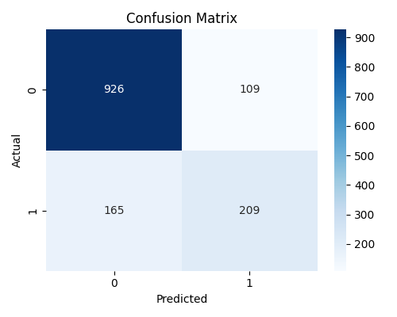

# Customer Churn Prediction – Machine Learning Project

## 📌 Problem Statement

Customer churn is a major business problem for telecom companies.  
The objective of this project is to predict whether a customer will churn based on account and service usage data.

Reducing churn directly increases revenue and customer lifetime value.

---

## 📊 Dataset

- Source: Telco Customer Churn Dataset
- Rows: ~7,000 customers
- Features: Demographics, Services, Account Information
- Target: `Churn` (Yes/No)

---

## 🛠 Tech Stack

- Python
- Pandas
- Scikit-Learn
- Logistic Regression
- Git & GitHub

---

## ⚙️ Approach

1. Data cleaning and preprocessing
2. Handling missing values
3. Encoding categorical variables (OneHotEncoding)
4. Train/Test split (80/20)
5. Logistic Regression model training
6. Model evaluation using:
   - Accuracy
   - Confusion Matrix
   - Precision / Recall / F1 Score

---

## 📈 Results

- Accuracy: **~80%**
- Precision (Churn): 0.66
- Recall (Churn): 0.56

### Business Insight

Recall for churn is critical because failing to identify a churner results in revenue loss.  
Future improvements would focus on increasing recall while balancing precision.

---

## 🚀 Future Improvements

- Hyperparameter tuning
- Feature scaling
- Random Forest / XGBoost comparison
- Threshold optimization
- Model deployment (Flask / FastAPI)

---

## ▶️ How to Run

```bash
pip install -r requirements.txt
python src/train.py

## 📂 Project Structure

customer-churn-ml/
│
├── data/
├── src/
│   └── train.py
├── requirements.txt
└── README.md


## Model Performance

Accuracy: 80.5%

### Confusion Matrix


